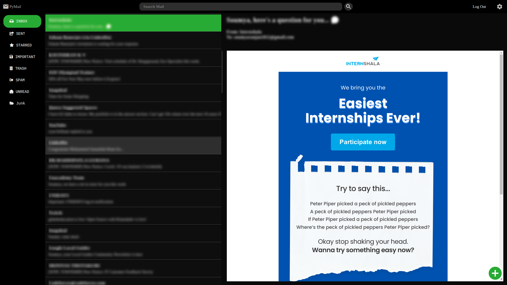

# Table of Contents:
1. [Introduction](#intro)
2. [Building PyEmailClient](#build)
3. [Usage](#usage)
	1. [Login](#login)
	2. [Email Dashboard](#dash)
	3. [Search Mail](#search)
	4. [Navigate Labels](#navigate)
	5. [Compose](#compose)
5. [Packages Used](#packages)
6. [Contributors](#contributors)
# Introduction 

**_PyMail_**(_PyEmailClient_) is fully functional, cross-platform Email Client for sending and browsing emails, written in Python. It only works for gmail accounts for now.

# Building PyEmailClient 

To setup the project, follow the following steps:

1.  Clone the repository into the directory of your choice and open the PyEmailClient directory.

        git clone git@github.com:SoumyaRanjanPatnaik/PyEmailClient.git
        cd PyEmailClient

2.  Download and install anaconda if not already installed. Visit https://conda.io/projects/conda/en/latest/user-guide/install/index.html to download it for your operating sytem. If you are on linux/MacOS, you can also intall it using the package manager included with your distro or use HomeBrew (Mac Users only).

	**NOTE**: If you are installing using graphical installer, make sure you select the add to path checkbox while installation, otherwise you will have to specify the absolute path of the anaconda executable instead of just typing _'conda'_

3.  Setup and activate anaconda environment.

		conda env create -f environment.yml
        conda activate EmailClient

    This will install all the required libraries and dependencies required for running PyMail inside the environment '_EmailClient_' and activate it. You are all set for reviewing the codebase, making changes and contributing to this repository.

4.  To run the program, first make sure that you are inside the _EmailClient_ anaconda environment. Then run the _Main.py_ python file.

		python Main.py

    The application should automatically open up.

5.  To build the distributable PyMail application, execute the _build.sh_ bash-script if you are on linux, _build_windows.sh_ if you are on windows or _build_mac.sh_ if you are on Mac OS. Mac users need to make sure you have bash shell installed in their terminal and windows users need to have 

	**On Linux**:

        ./build.sh

	**On Windows**:

		./build_windows.sh

	**On Mac OS**:

		./build_mac.sh
			

    A _build.bat_ file will soon be added to this repository, which will allow for easily building PyMail from winows.

	Alternatively, you can run the following command

		python -m eel Main.py Static -n "PyEmailClient" --add-data "client_secret.json:." --add-data "token_gmail_v1.pickle:." --noconsole --icon = ./assets/logo.ico

	Make sure you have a _client_secret.json_ file and _toke_gmail_v1.pickle_ file before building. If it is not present, you can crerate blank files with the above mentioned file names too.

    	touch token_gmail_v1.pickle
    	touch client_secret.json

6. To view your distributable, open the dist/PyEmailClient/ directory and run PyEmailClient or PyEmailClient.exe(in case of windows).

	You can also type the following commands on the terminal:

	**On Linux and Mac OS**:
		
		cd dist/PyEmailClient
		./PyEmailClient

	**On Windows**:

		cd dist\PyEmailClient
		.\PyEmailClient.exe

# Usage 

This app requires a chromium-based browser or chrome for the best experience. But the app can be opened in a browser as a web-app

## 1. Login:

You can log into the software by using OAuth2.0. Upon opening PyMail, you will see the login page. 

<figcaption align = "center"><b>Fig.1(a) - Login Page (Light)</b></figcaption>

<figcaption align = "center"><b>Fig.1(b) - Login Page (Dark)</b></figcaption>

On clicking the login button (or Continue to PyMail button if you've logged in before), you will be redirected to the google authentication page. On successful authentication, a token file by the name of _token_gmail_v1.pickle_ will be generated to keep the user logged-in.

**NOTE**: Do **_NOT_** share the token file (token_gmail_v1.pickle) with anyone. Doing so will allow anyone to access your GMail account.

## 2. Email Dasboard :
The image of the email Dashboard has been attatched below:

<figcaption align = "center"><b>Fig.2 - Dashboard </b></figcaption> 

**NOTE**: No images for the listing of mails portion has been shown for privacy reasons.

## 3. Search for mails:
Type your search query inside the "Search Mail" field present in the top-bar.

<figcaption align = "center"><b>Fig.3 - Search bar / top bar </b></figcaption>

## 4. Navigate lables
Click on the name of the label on the navigation pane present on the left side of the window to see all the emails tagged with that label.

## 5. Compose:
Click the plus (+) icon to open the compose window.

<figcaption align = "center"><b>Fig.4 - Compose Icon </b></figcaption>

On clicking, the compose window opens up and the plus icon rotates to become the close window icon.

<figcaption align = "center"><b>Fig.5 - Compose Windows (Dark)</b></figcaption>

## 6. Switching thmes:

Click on the settings icon in the top-right corner of the screen. This should toggle the theme from light to dark. Also, the theme that you last chose will load by default. 

# Packages Used
1. Gmail API
2. Python Eel
3. PyInstaller
# Contributors
1. Divyanshu Tirkey
2. Kshitiz Kumar Singh
3. Soumya Ranjan Patnaik